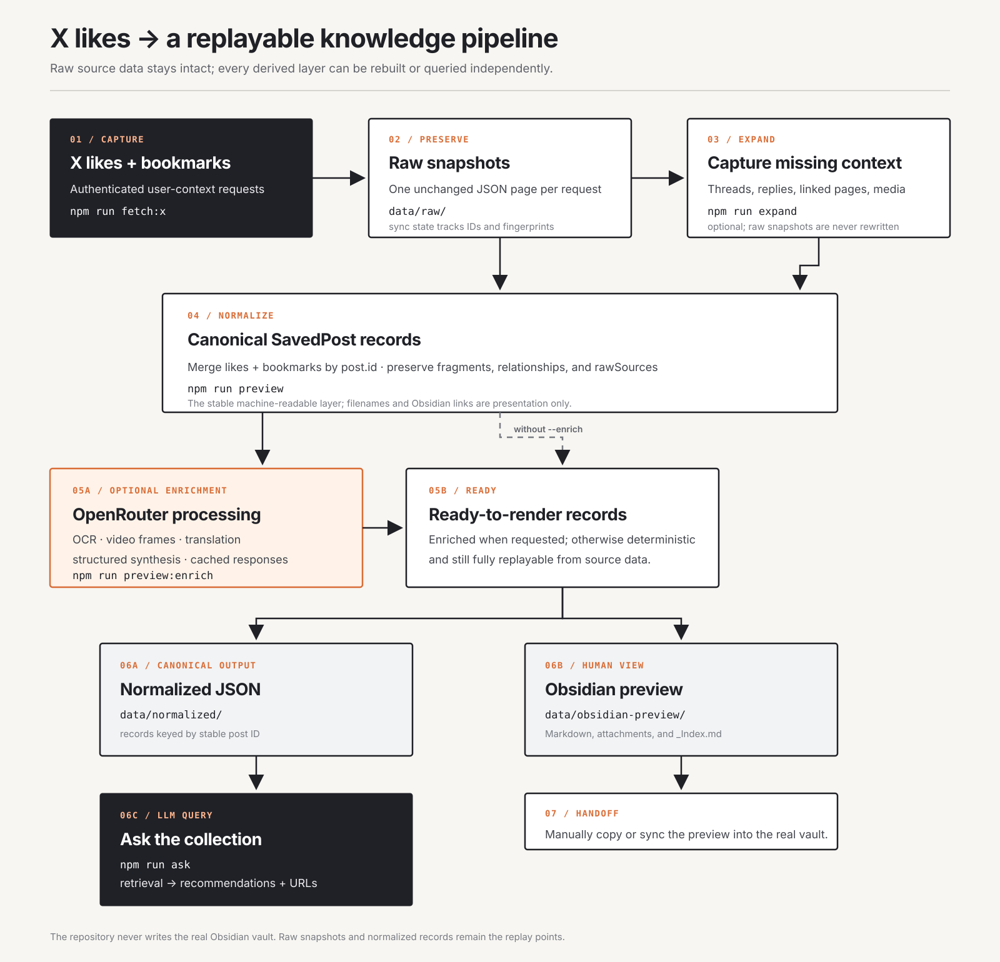

# Ingestion pipeline

The repository keeps raw X responses and replayable canonical records separate
from the Markdown preview. `npm run ingest` runs the capture, expansion, and
enriched-preview stages in order.



The diagram is an SVG so labels stay exact and it renders as an image in
GitHub, Obsidian, and other Markdown viewers. The table below is the
text-only/accessibility fallback.

## Flow at a glance

`X likes/bookmarks` → `unchanged raw JSON` → `expanded source captures` →
`canonical SavedPost records` → `optional OpenRouter enrichment` →
`normalized JSON + Markdown preview` → `manual vault handoff`

The separate query path is:

`normalized JSON` → `npm run ask` → `LLM recommendations with source URLs`

## Stages

| Stage | Command | Reads | Produces |
| --- | --- | --- | --- |
| Capture | `npm run fetch:x` | X likes and bookmarks endpoints | Byte-for-byte pages in `data/raw/` |
| Sync bookkeeping | (part of capture) | Current post IDs and source payloads | `data/state/sync.json` with fingerprints and capture methods |
| Expand | `npm run expand` | Latest raw pages | Optional thread/context JSON, external HTML, and media captures |
| Normalize | `npm run preview` | Raw pages plus expansion captures | One `SavedPost` record per post ID, retaining `rawSources` |
| Enrich | `npm run preview:enrich` | Canonical records and media | Cached OCR, video-frame analysis, translation, and synthesis |
| Render | (part of preview) | Ready-to-render `SavedPost` records | `data/normalized/` and `data/obsidian-preview/` |
| Query | `npm run ask -- "your question"` | Latest normalized snapshot | Recommendations grounded in matching posts and linked source URLs |
| Handoff | Manual | Markdown preview | Copy/sync into the real Obsidian vault; this repository never writes it |

`npm run ingest` runs capture, expansion, and enriched preview in sequence.

## Commands

```bash
npm run fetch:x       # fetch likes and bookmarks; save raw pages
npm run expand        # reuse raw pages; capture missing threads, context, links
npm run preview       # normalize and render without paid enrichment
npm run preview:enrich # add cached/optional OpenRouter enrichment
npm run ingest        # fetch:x -> expand -> preview:enrich
npm run ask -- "your question" # query the latest normalized snapshot
```

Raw snapshots are the replay point. Expansion and enrichment add separate
captures or caches; they do not rewrite the original X response. The latest
normalized snapshot is the machine-readable source for querying, while the
Markdown directory is a human-facing preview that can be copied into a vault.
